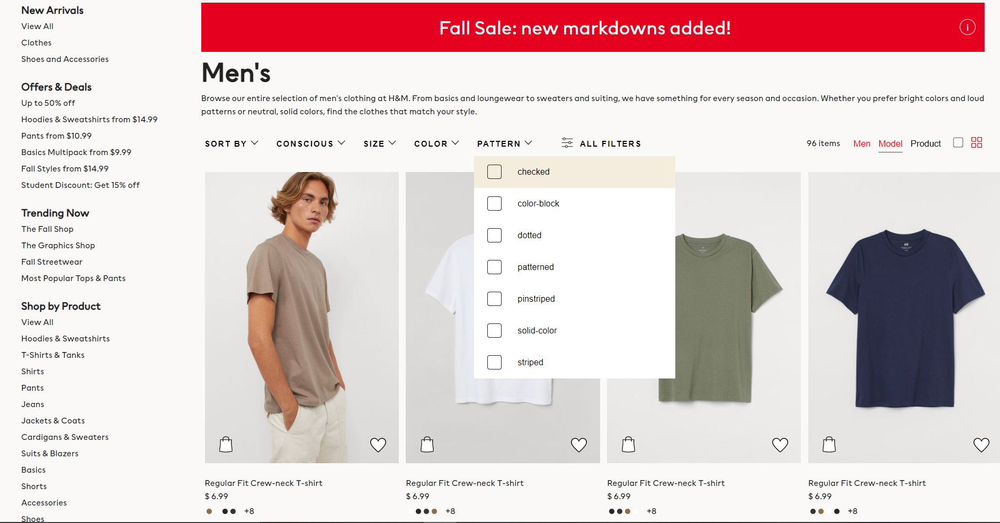

# H&M Lite   
**Stack:** *HTML, CSS, Javascript*

**Data Finished:** 01/13/2022

#### **Objective 📈:** **Replicate a successful company' Website**

**Requirements** 🚦

• *Must look 90%+ identical. Someone should be able to look and say "what are you doing on X Company's site" without hesitation!*

• *Cannot look at HTML design from source to copy structure *A1*

&nbsp;

**Allowed:** 

• Copying fonts, colors and sizes 

(*Reasoning:* The focus is learning good design practices for future projects)

•*A1 Looking at images, understanding div sections breakpoints, and seeing if pseudo elements are used is allowed 

(*Reasoning:* This helps future functionality and understanding of libraries used (SASS, jQuery, etc))

&nbsp;
&nbsp;

**⚖️ What's the most technically challenging part of this project and why? ⚖️**

&emsp; &emsp; Building a strong foundation for my project was difficult. Whenever I thought a complex div was finished, I realized I missed a few elements or didn’t wrap the container correctly. This also applied to JS functions. I accepted any answer that worked instead of considering how it’d work with other functions/elements. 

&emsp; &emsp;This wasted a lot of time and could have been avoided if I spent more time thinking about scalability. Whenever I kept trying to build on top of the base, I’d have to rewrite and rewrite functionality. 

&nbsp;

# Realizations ⌛️

• You can use a comma (“,”) for a space when using classList.add in Javascript

• Pseudo Elements can be Classes or Elements and are used to decorate the page. 

&emsp; &emsp;If an image doesn’t load, a pseudo element can be shown to display an idea of what should be there. It can also be used to save space if elements aren’t used on certain media queries. 

• Using px’s for most elements is acceptable. 

&emsp; &emsp; This was an eye opening because I thought only % and viewport lengths were acceptable unless working on fixed elements (borders). However, the main idea is making the website accessible to everyone. If the element is RWD with PX, it doesn’t matter what measurements are used.

•  Padding/Max Width’s should be used with CSS Grid’s. This allows for more RWD. 

• Hiding/Showing text through buttons can be done to increase user experience. 

• The difference between HTMLcollection live vs nodelist: Only some element retrievers are live.  

| document.getElementsByClassName() is an HTMLCollection, and is live.

| document.getElementsByTagName() is an HTMLCollection, and is live.

| document.getElementsByName() is a NodeList and is live.

| document.querySelectorAll() is a NodeList and is not live.

&nbsp;

# Problems 😎

### Major

• **(NA) Not understanding the Entire Scope of the Project**

&emsp; &emsp;I had the idea of making H&M Lite for weeks now. I downloaded what I needed for the design but didn't explore what techniques H&M used. There were overlay png's, product names, designs, and other content that changed since I considered the venture. This made get the design 1:1 harder, particularly the product names and prices of removed items. 

&nbsp;

• **(1) Dynamic Creation of Custom Filters Stopping**

&emsp; &emsp;This issue is replicated by deleting all filters and attempting to readd new filters. I’ve spent time trying to understand the error to no avail. The code should work because the new elements can be displayed in the console. 

💡*I think this issue lies with how exclusive filters was functioned or dynamic creation failing due to node value changing after deletion of all filters.*

&nbsp;

• **(2) Cart Multiplication is Incorrect**

>   (1) 6.99 (Base Product Value - ID 1)

    Quantity     	 Output               Expected

    (2)              20.97                13.98

    (3) 	      	 41.94                20.97

    (4)	      	     69.9                 27.96

    (5) 	      	 104.85        	      34.95

&nbsp;

🔑*Simplifying selectors to only one selector for the total. I used too many selectors which added unnecessary computation.*

&nbsp;

• **(3) Exclusive Filter Options**

&emsp; &emsp;Some Filters can’t coexist, such as Highest Price and Lowest Price. I had a problem being able to filter through all custom filter tags. Whenever I tried to remove a filter, all of them would be removed. 

🔑*Using an indexOf to filter between the custom filters and only deleting tags that fit the criteria.*

&nbsp;

• **(4) Filtered Searches with more than 1 Word**

&emsp; &emsp;Huge issue: I didn't think ahead and create a filter system for the products. If I added a div with types, filtering would've been easy, especially colors.

🔑*Solution: Order of word filters mattered. If I placed the color filter at the bottom, all products would become hidden. I had to think of execution order of filters and then organize accordingly.*

&nbsp;

&nbsp;

### Minor

• **Comments lead to line breaks (CSS ONLY). This prevented me from commenting more often, especially commenting to convert rem sizes**

🔑 *Removing the overflow-x:hidden and just placing it in the body tagged fixed my problem*

&nbsp;

• **HTML Collection vs NodeList**

>   document.querySelectorAll is static
    var sizeTest5 = document.querySelectorAll(“div.filtContainer.fav”);

    Array.from(sizeTest5).forEach(sideTest5 => sideTest5.classList.add('hideFilterContainer'));

🔑 *I used Array.from to get an updated list and use forEach to cycle to achieve the result I wanted: making all new favorite products hide sizeContainers.*

&nbsp;

• **Forgetting to use declarations in for of loops**

&nbsp;

&nbsp;

#### Future Features

• Making Advanced searches (3-7 word searches) with auto-correct searches

• A product grid size change button (red/white buttons on the right side above filter headers)

• Switch sections (Men/Women and even new sections)

• Saving space in the HTML & CSS write up by using a database for products or an alternative solution

*📚 Lesson Credit | Sasha Kondrashov*

The difference between HTMLcollection live vs nodelist   

https://stackoverflow.com/questions/14377590/queryselector-and-queryselectorall-vs-getelementsbyclassname-and-getelementbyid
